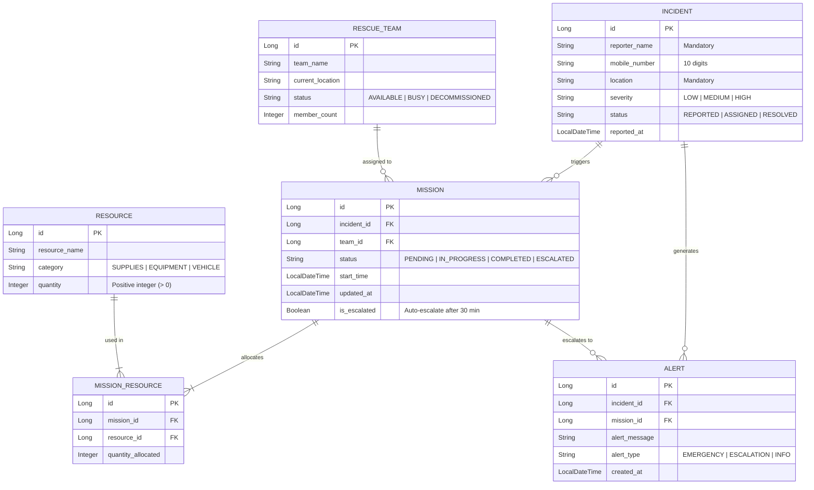

# 🚨 Smart Disaster Response Coordination System

A microservices-based RESTful API system designed to coordinate and streamline rescue operations during critical disasters such as floods, cyclones, earthquakes, and fires.

---

## 📌 Project Overview

During severe emergencies, rapid response and efficient resource allocation save lives. The **Smart Disaster Response Coordination System** facilitates real-time incident reporting, dynamic rescue team dispatching, resource tracking, and automated mission escalation. Built on a resilient microservices architecture, it ensures seamless communication and high availability across response operations.

* **Architecture:** Microservices Architecture (via API Gateway)

---

## 🛠️ Tech Stack & Prerequisites

* **Java Version:** Java 17
* **Framework:** Spring Boot
* **Database:** **H2 In-Memory Database**
* **Inter-Service Communication:** RestTemplate
* **API Gateway:** Spring Cloud Gateway
* **Validation:** Spring Boot Starter Validation (Hibernate Validator)
* **Build Tool:** Maven / Gradle

---

## 🏗️ Microservices Architecture

The system is decoupled into five core microservices managed through a centralized **API Gateway**:

1. **Incident Service:** Handles incident reporting, geolocation, and severity categorization.
2. **Rescue Team Service:** Manages team availability, status tracking, and dispatching.
3. **Resource Service:** Tracks available emergency supplies, equipment, and allocation metrics.
4. **Mission Service:** Coordinates rescue missions, links incidents with teams and resources, and manages execution lifecycle.
5. **Alert Service:** Dispatches emergency alerts and manages mission escalation workflows.

---

## ⚙️ Core Business Rules

* **Nearest Team Assignment:** Prioritizes and assigns the closest available rescue team to an incident site.
* **Severity Priority:** High-severity incidents (`HIGH`) receive top priority during team and resource allocation.
* **Availability Guard:** Busy or dispatched teams cannot be assigned to new missions until released.
* **Resource Lifecycle:** Automatically releases teams and restores resource stock upon mission completion.
* **Automated Escalation:** Unresolved or pending missions are automatically escalated after **30 minutes**.

---

## 📋 Data Validation Rules

* **Reporter Name:** Required (cannot be empty).
* **Mobile Number:** Must be a valid 10-digit number (`^[0-9]{10}$`).
* **Location:** Mandatory field.
* **Severity Levels:** Strictly enforced via Enum (`LOW`, `MEDIUM`, `HIGH`).
* **Resource Quantity:** Must be a positive integer (`> 0`).

---

## 📡 API Endpoints Summary

All incoming requests route through the **API Gateway**.

### 1. Incident Service (`/incidents`)

| Method | Endpoint | Description |
| --- | --- | --- |
| `POST` | `/incidents` | Report a new disaster incident |
| `GET` | `/incidents` | Retrieve all reported incidents |
| `GET` | `/incidents/{id}` | Get specific incident details |
| `PUT` | `/incidents/{id}` | Update incident details/status |
| `DELETE` | `/incidents/{id}` | Remove an incident record |

### 2. Rescue Team Service (`/teams`)

| Method | Endpoint | Description |
| --- | --- | --- |
| `POST` | `/teams` | Register a new rescue team |
| `GET` | `/teams` | List all rescue teams and statuses |
| `GET` | `/teams/{id}` | Fetch team details |
| `PUT` | `/teams/{id}` | Update team availability/status |
| `DELETE` | `/teams/{id}` | Decommission a team |

### 3. Resource Service (`/resources`)

| Method | Endpoint | Description |
| --- | --- | --- |
| `POST` | `/resources` | Add new emergency resources |
| `GET` | `/resources` | Fetch inventory list |
| `GET` | `/resources/{id}` | Retrieve resource info |
| `PUT` | `/resources/{id}` | Update resource quantities |
| `DELETE` | `/resources/{id}` | Delete a resource record |

### 4. Mission Service (`/missions`)

| Method | Endpoint | Description |
| --- | --- | --- |
| `POST` | `/missions` | Create and assign a rescue mission |
| `GET` | `/missions` | Fetch all ongoing and completed missions |
| `GET` | `/missions/{id}` | Fetch mission status |
| `PUT` | `/missions/{id}` | Update mission progress / Mark complete |

### 5. Alert Service (`/alerts`)

| Method | Endpoint | Description |
| --- | --- | --- |
| `POST` | `/alerts` | Dispatch manual alerts |
| `GET` | `/alerts` | Retrieve active system and escalation alerts |

---

## ⚠️ Global Exception Handling

Centralized error handling using Spring's `@RestControllerAdvice` and `@ExceptionHandler` ensures clean, standard JSON error responses across all microservices:

* `IncidentNotFoundException` — Thrown when an incident ID does not exist.
* `TeamNotFoundException` — Thrown when a specified team cannot be located.
* `ResourceNotFoundException` — Thrown when requested supplies are missing or unavailable.
* `MissionNotFoundException` — Thrown when a mission lookup fails.
* `NoAvailableTeamException` — Thrown when no eligible or idle team is available for dispatch.
* `MethodArgumentNotValidException` — Standard validation error wrapper returning detailed field validation failures.

---

## 🗄️ Database Configuration (H2 Database)

The project relies on an **H2 In-Memory Database** for quick execution, seamless integration testing, and zero-setup deployment.

### Example `application.yml` / `application.properties` Configuration:

```yaml
spring:
  datasource:
    url: jdbc:h2:mem:disasterdb
    driver-class-name: org.h2.Driver
    username: sa
    password: password
  h2:
    console:
      enabled: true
      path: /h2-console
  jpa:
    database-platform: org.hibernate.dialect.H2Dialect
    hibernate:
      ddl-auto: update

```

> **Note:** Access the interactive database console by starting the service and visiting `http://localhost:<SERVICE_PORT>/h2-console` in your browser.



## 🚀 Getting Started

### Prerequisites

* **Java 17 JDK** or higher
* **Apache Maven 3.8+**
## ScreenShots of my Project


<div align="center">

### 🛠️ Project Creator & Developer

**Designed and coded by Rithika K**  
*Smart Disaster Response Coordination System — Capstone Project*

[](https://linkedin.com/in/rithika-karthikeyan-a2526a380/)
[](https://github.com/Rithika-220707)

</div>
